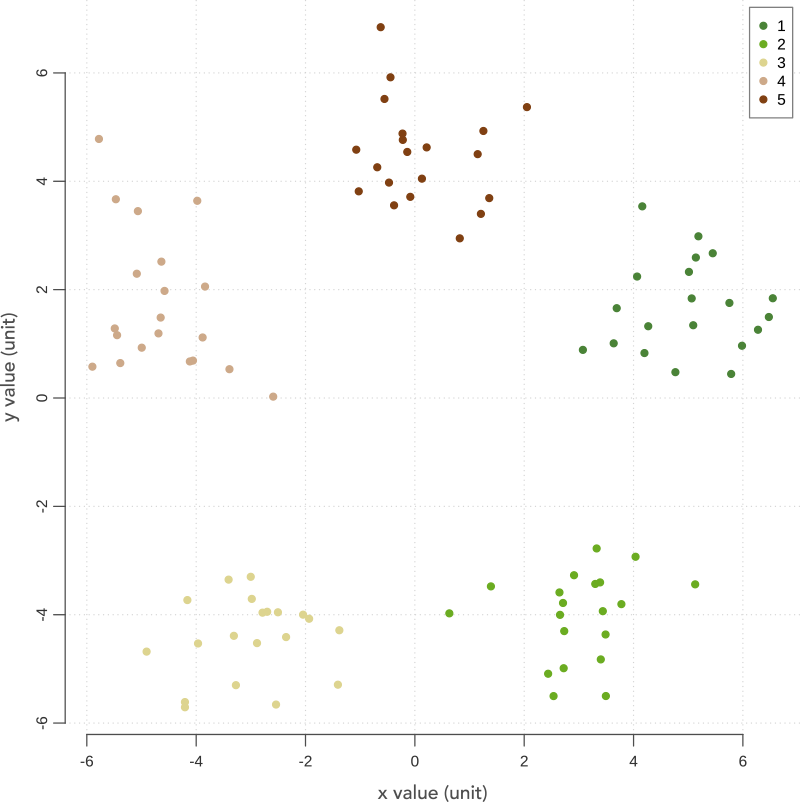
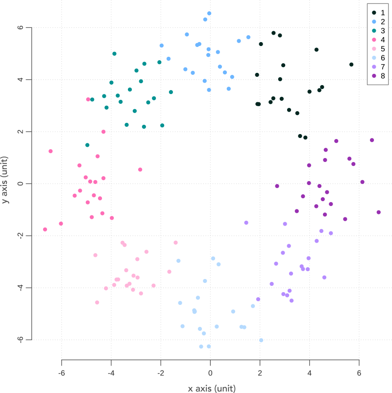

# R-figure-aesthetics
```R
set.seed(123)
x = rnorm(20)

pdf("plot-1.pdf")
par(mar=c(3.1,3.1,0,0))
plot(x, panel.first=grid(),
     bty="n", ylab="", xlab="", xaxt="n", yaxt="n", type="n")
lines(x, lwd=2, col="gray20")

axis(side=1, col="gray30", cex.axis=.8, padj=-.9, col.axis="gray20")
axis(side=2, col="gray30", cex.axis=.8, padj= .9, col.axis="gray20")
title(xlab="x value (unit)", line=2, col.lab="gray30")
title(ylab="y value (unit)", line=2, col.lab="gray30")
dev.off()
```


```R
set.seed(123)
x = c(4.76,  2.94, -2.94, -4.76, 0.00) + rnorm(100)
y = c(1.54, -4.04, -4.04,  1.54, 5.00) + rnorm(100)

avocado_palette = c( "#4a8337", "#6bac21", "#ddd48f", "#cda989", "#804012")

pdf("plot-2.pdf")
par(mar=c(3.1,3.1,0,0))

plot(x, y, panel.first=grid(),
     bty="n", ylab="", xlab="", xaxt="n", yaxt="n", type="n")
points(x, y, pch=19, cex=.8, col=avocado_palette)

axis(side=1, col="gray30", cex.axis=.8, padj=-.9, col.axis="gray20")
axis(side=2, col="gray30", cex.axis=.8, padj= .9, col.axis="gray20")
title(xlab="x value (unit)", line=2, col.lab="gray30")
title(ylab="y value (unit)", line=2, col.lab="gray30")

legend(x="topright", inset=.01,
     bg="white", box.col="gray50",
     legend=1:5, col=avocado_palette, pch=19, cex=.8)

dev.off()
```


```R
set.seed(123)
x = c(4.76,  2.94, -2.94, -4.76, 0.00) + rnorm(100)
y = c(1.54, -4.04, -4.04,  1.54, 5.00) + rnorm(100)

happy_palette = c("#008f97", "#6bc0b7", "#fed769", "#eb8d2c", "#ef3e4a")

pdf("plot-3.pdf")
par(mar=c(3.1,3.1,0,0))

plot(x, y, panel.first=grid(),
     bty="n", ylab="", xlab="", xaxt="n", yaxt="n", type="n")
points(x, y, pch=19, cex=.8, col=happy_palette)

axis(side=1, col="gray30", cex.axis=.8, padj=-.9, col.axis="gray20")
axis(side=2, col="gray30", cex.axis=.8, padj= .9, col.axis="gray20")
title(xlab="x value (unit)", line=2, col.lab="gray30")
title(ylab="y value (unit)", line=2, col.lab="gray30")

legend(x="topright", inset=.01,
     bg="white", box.col="gray50",
     legend=1:5, col=happy_palette, pch=19, cex=.8)

dev.off()
```

